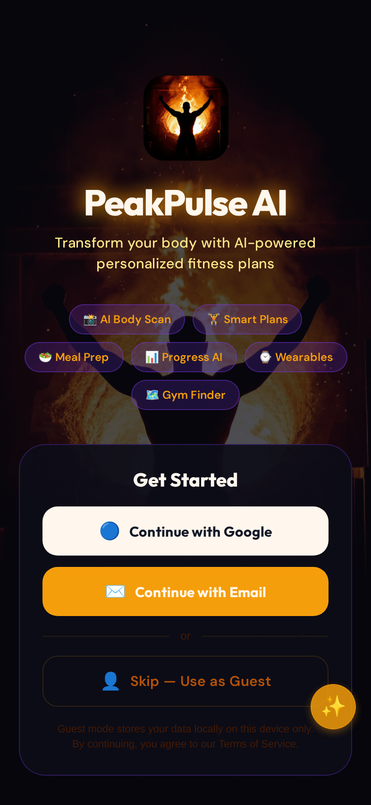

# PeakPulse AI — Comprehensive App Overview

**Version:** 1.0.0  
**Platform:** iOS, Android, Web (via Expo / React Native)  
**Tech Stack:** Expo SDK 54, React Native 0.81, TypeScript 5.9, NativeWind 4, tRPC, PostgreSQL, Drizzle ORM

---

## Table of Contents

1. [Introduction](#introduction)
2. [App Architecture](#app-architecture)
3. [Onboarding Flow](#onboarding-flow)
4. [Main Navigation (5 Tabs)](#main-navigation)
5. [Dashboard (Home Tab)](#dashboard)
6. [AI Body Scan (Scan Tab)](#ai-body-scan)
7. [Workout Plans (Plans Tab)](#workout-plans)
8. [Meals & Nutrition (Meals Tab)](#meals--nutrition)
9. [Profile & Settings (Profile Tab)](#profile--settings)
10. [AI Coach & Floating Assistant](#ai-coach--floating-assistant)
11. [Exercise Library & Demos](#exercise-library--demos)
12. [Social Features](#social-features)
13. [Wearable Integration](#wearable-integration)
14. [Subscription & Monetisation](#subscription--monetisation)
15. [Notifications & Reminders](#notifications--reminders)
16. [Data & Privacy](#data--privacy)
17. [Technical Statistics](#technical-statistics)

---

## Introduction

PeakPulse AI is a comprehensive, AI-powered fitness companion mobile application designed to transform how users approach their fitness journey. The app combines artificial intelligence with personalised fitness planning, nutrition tracking, body composition analysis, and social features to deliver a premium, all-in-one fitness experience.

The application features a cinematic dark theme with golden/amber accents (the "Aurora Titan" design language), full-screen AI-generated backgrounds, animated transitions, and a polished user interface that feels like a first-party iOS application. Every interaction includes haptic feedback, smooth animations, and thoughtful micro-interactions.

---

## App Architecture

PeakPulse AI follows a modern mobile architecture with clear separation of concerns.

| Layer | Technology | Purpose |
|-------|-----------|---------|
| **Frontend** | React Native + Expo SDK 54 | Cross-platform mobile UI |
| **Styling** | NativeWind 4 (Tailwind CSS) | Utility-first responsive styling |
| **Navigation** | Expo Router 6 | File-based routing with deep links |
| **State** | React Context + AsyncStorage | Local state management and persistence |
| **API Client** | tRPC + TanStack Query | Type-safe API calls with caching |
| **Backend** | Express + tRPC Server | REST/RPC API endpoints |
| **AI** | Built-in LLM (Multimodal) | Text, image, and audio AI capabilities |
| **Database** | PostgreSQL + Drizzle ORM | Persistent data storage |
| **File Storage** | S3-compatible | User photos and generated images |
| **Auth** | OAuth (Google) + Email + Guest | Flexible authentication |

### Project Statistics

| Metric | Count |
|--------|-------|
| App Screens | 55 |
| Reusable Components | 18 |
| Library Modules | 43 |
| Custom Hooks | 5 |
| Server Files | 18 |
| Test Files | 42 |
| Test Assertions | 2,868 |
| Tests Passing | 1,327 |
| Total Lines of Code | 61,787 |
| Exercise GIF Assets | 77 |
| GIF Asset Size | 18 MB |

---

## Onboarding Flow

The onboarding experience is designed to collect essential user information while showcasing the app's capabilities through a visually stunning, multi-slide introduction.

### Slide 1: Welcome
A full-screen cinematic background showing a dramatic gym scene with golden lighting. The slide introduces PeakPulse AI with feature badges highlighting the core capabilities: AI Workout Plans, Smart Meal Plans, AI Body Scan, and Wearable Sync. Users can skip the onboarding at any time.

### Slide 2: AI-Powered Features
Showcases the app's AI capabilities with animated feature cards and descriptions of what the AI can do for the user's fitness journey.

### Slide 3: Get Started
Presents authentication options: Continue with Google, Continue with Email, or Skip (Use as Guest). Guest mode stores all data locally on the device, making the app fully functional without an account.

### Post-Authentication Setup
After authentication or guest selection, users complete a profile setup flow:

1. **Personal Details** — Name, age, height, weight, gender
2. **Fitness Goal** — Build muscle, lose fat, maintain, or athletic performance
3. **Workout Style** — Gym, home, mix, or calisthenics
4. **Dietary Preferences** — Omnivore, halal, vegan, vegetarian, keto, or paleo
5. **Body Scan** (optional) — Take a full-body photo for AI body fat estimation
6. **Transformation Preview** — AI generates body transformation images at different body fat percentages (10%, 12%, 15%, 20%, 25%)
7. **Target Selection** — User picks their preferred body composition target
8. **Plan Generation** — AI automatically generates personalised workout and meal plans

### Onboarding Summary Screen
After completing setup, users see a summary of their generated AI workout plan, meal recommendations, and a before/after target photo comparison. This is followed by a subscription plan selection screen (Free Trial / Basic / Advanced) and a first-time dashboard tutorial overlay.

---

## Main Navigation

The app uses a 5-tab bottom navigation bar with the following structure:

| Tab | Icon | Screen | Description |
|-----|------|--------|-------------|
| **Home** | house | Dashboard | Overview stats, AI insights, quick actions |
| **Scan** | camera | AI Body Scan | Camera-based body composition analysis |
| **Plans** | dumbbell | Workout Plans | AI-generated workout schedules |
| **Meals** | restaurant | Nutrition | Meal plans, food diary, calorie tracking |
| **Profile** | person | Profile | Settings, progress photos, wearables |

An additional **AI Coach** tab with a distinctive teal icon provides access to the dedicated AI coaching screen with insights and chat functionality.

---

## Dashboard

The Dashboard serves as the app's command centre, providing an at-a-glance overview of the user's fitness status and quick access to all features.

### Dashboard Components

**Hero Section** — Personalised greeting with the user's name, current streak count, and XP level. Animated SVG progress rings display daily targets for calories, steps, water, and protein.

**AI Daily Insight** — A rotating card that provides AI-generated fitness tips, motivational messages, and personalised recommendations based on the user's activity history. Tips rotate every 5 minutes.

**Body Fat Estimate Card** — Shows the latest BF% from the most recent body scan with a comparison to the user's target. Tapping opens the full body scan history.

**Today's Workout Preview** — A compact card showing today's scheduled workout from the AI-generated plan, with a "Start Workout" button for immediate access.

**Calorie Progress Bar** — Real-time calorie tracking showing consumed vs. target (calculated using the Mifflin-St Jeor TDEE formula based on user profile data).

**Wearable Data Display** — Steps, calories burned, heart rate, and sleep data synced from connected wearable devices.

**Quick Action Grid** — 12 shortcut buttons providing one-tap access to key features:

| Quick Action | Destination |
|-------------|-------------|
| AI Body Scan | Body scan camera |
| Smart Plans | Workout plans |
| Meal Prep | Meal preparation |
| Progress AI | Progress photos |
| Wearables | Wearable sync |
| Gym Finder | Nearby gym map |
| Snap a Meal | Photo calorie estimator |
| Meal Timeline | Meal photo history |
| Scan Receipt | Receipt-to-pantry scanner |
| Social Circle | Friend leaderboard |
| AI Reminders | Notification settings |
| 7-Day Challenge | Guided challenge |

**Muscle Balance Heatmap** — A colour-coded body diagram showing which muscle groups are over-exercised (red), optimally trained (green), or under-exercised (blue) based on recent workout history. Configurable time window (7, 14, or 30 days).

**Suggested Exercises** — AI-generated exercise recommendations based on muscle balance analysis, prioritising under-exercised muscle groups.

**Personal Records** — Recent PRs with trend direction indicators showing progress on key lifts.

**Trend Charts** — Weekly muscle balance evolution displayed as SVG line charts with smooth Catmull-Rom curves.

**Streak & Gamification** — Current workout streak, XP points, and milestone celebrations with shareable achievement cards.

**Trial Status Banner** — For trial users, shows remaining days and an upgrade CTA. For expired trials, shows an upgrade prompt.

---

## AI Body Scan

The AI Body Scan feature uses the device camera and server-side AI to estimate body fat percentage and generate transformation previews.

### How It Works

1. **Photo Capture** — User takes a full-body photo using the device camera or selects from gallery
2. **AI Analysis** — The photo is uploaded to S3 and sent to the server's built-in LLM for multimodal analysis
3. **BF% Estimation** — AI estimates current body fat percentage using the photo combined with user metrics (weight, height, age, gender)
4. **Transformation Previews** — AI generates body transformation images at 5 target BF% levels (10%, 12%, 15%, 20%, 25%)
5. **Target Selection** — User selects their preferred target, which is saved to their profile
6. **Plan Integration** — The selected target informs AI workout and meal plan generation

### Additional Features

**Fullscreen Preview** — Tapping any transformation card opens a fullscreen modal with pinch-to-zoom and before/after swipe comparison.

**Progress Comparison** — A dedicated comparison screen with a drag-to-reveal slider between any two scan dates, showing stats differences (weight, body fat, measurements).

**Collage Export** — Branded side-by-side collage (first + latest photo) with weight and BF% delta overlays, exportable to camera roll and shareable via the system share sheet.

**Timeline Scrubber** — Select any two months to compare, driving the comparison slider with the selected photos and stats overlay.

**Transformation Reminder** — Post-onboarding screen showing initial photo vs. AI target body image as ongoing motivation.

---

## Workout Plans

The Plans tab provides AI-generated, personalised workout schedules with a comprehensive exercise tracking system.

### AI Plan Generation

Workout plans are generated by the server-side LLM based on:
- User's fitness goal (build muscle, lose fat, maintain, athletic)
- Workout style preference (gym, home, mix, calisthenics)
- Training days per week (3-6)
- Current body composition and metrics
- Available equipment

### Plan Display

**Summary Header** — Compact badge row showing current goal, style, and training days.

**Today's Workout (Hero)** — The current day's workout is highlighted with a gold border accent, showing all exercises with sets, reps, and rest periods.

**Other Days** — Remaining days displayed in a collapsible "Other Days" section below.

**Exercise Cards** — Each exercise card displays:
- Exercise name and target muscle group
- Sets x reps with weight recommendations
- Animated GIF demonstration (locally bundled, 77 exercises)
- Front/side angle toggle for multi-view demonstrations
- Form cue text with key technique points
- Inline anatomical muscle diagram highlighting targeted muscles
- "Try Instead" alternatives section with 3-5 similar exercises

### Active Workout Session

Tapping "Start Workout" launches an immersive exercise-by-exercise session tracker:

- **Exercise Timer** — Configurable rest intervals per exercise type (compound: 90s, isolation: 60s, cardio: 30s, stretching: 45s)
- **GIF Demo** — Locally bundled animated GIF showing proper form with fullscreen modal
- **Set Tracking** — Log completed sets with weight and reps
- **Muscle Diagram** — Inline body diagram showing targeted muscles
- **Video Preloading** — Next exercise's assets are preloaded during rest periods
- **PR Detection** — Automatic personal record detection and notification
- **Session Summary** — Workout duration, exercises completed, estimated calories burned
- **Health Write-Back** — Completed workouts are logged to Apple Health / Health Connect

### Custom Workout Builder

Users can create custom workouts via the Create Custom Workout screen:
- Browse exercises by 14 categories (Upper Body, Chest, Back, Shoulders, etc.)
- Search and filter exercises
- AI rep suggestions based on fitness level and goals
- AI balance analysis showing if the workout is too heavy on certain muscle groups
- AI calorie expenditure estimate
- AI muscle gain / fat loss projections over time
- AI coaching suggestions for workout improvement

### Workout Templates

Pre-built workout templates for common training splits (Push/Pull/Legs, Upper/Lower, Full Body, etc.) that can be customised and saved.

### Regenerate Plans

A "Regenerate Plans" button allows refreshing AI workout plans after goal changes, ensuring plans stay aligned with evolving fitness objectives.

---

## Meals & Nutrition

The Meals tab provides comprehensive nutrition tracking, AI meal planning, and food logging capabilities.

### AI Meal Plan Generation

Meal plans are generated by the server-side LLM based on:
- User's dietary preference (omnivore, halal, vegan, vegetarian, keto, paleo)
- Fitness goal and workout plan
- Personalised TDEE calorie targets (Mifflin-St Jeor formula)
- User's favourite foods (optional)
- Pantry inventory (optional)

### 7-Day Meal Plan Display

**Day Selector** — Browse all 7 days of the AI-generated meal plan with a horizontal day picker.

**Meal Cards** — Each meal (breakfast, lunch, dinner, snacks) shows:
- Meal name with unique AI-fetched food photo
- Calorie and macro breakdown (protein, carbs, fat)
- Expandable "How to Prep" section with step-by-step cooking instructions
- Dietary tags (halal, vegan, keto, etc.)

### AI Meal Swap

Tapping any meal opens the AI Meal Swap feature:
- AI generates 6 calorie-equivalent alternatives matching macros and dietary tags
- Each alternative includes prep time, ingredients, and step-by-step instructions
- Tap an alternative to see full prep detail before confirming the swap

### Meal Logging

**Manual Entry** — Log meals with name, calories, and macros via a form.

**AI Photo Scanner** — Take a photo of any meal for AI-powered calorie estimation:
- Camera or gallery picker via expo-image-picker
- Photo uploaded to S3, analysed by server-side LLM
- Returns detected food items with portions, calories, macros, health score (1-10), and meal type
- Portion size adjustment slider (0.25x to 3.0x) with preset buttons
- One-tap "Log This Meal" saves to calorie tracker

**Barcode Scanner** — Scan product barcodes for nutritional information lookup.

### Food Diary

**Daily Overview** — Day's meals displayed as tiles (breakfast, lunch, snack, dinner) with calorie totals.

**Calorie Progress** — Real-time progress bar showing consumed vs. target calories.

**Macro Tracking** — Protein, carbs, and fat tracked against daily targets.

**Nutrition Charts** — Inline mini bar charts with link to full nutrition analytics screen showing weekly/monthly trends.

### Meal Photo Timeline

A chronological timeline of all meal photos, grouped by date with expandable cards showing full macro breakdowns.

### Meal Favourites

Star button on logged meals to save favourites. Saved foods section with expand/collapse and autocomplete dropdown when typing 2+ characters matching favourited meals.

### Meal Prep Planning

AI-generated batch cooking plans based on dietary preferences with:
- Ingredient lists and batch cooking instructions
- Shopping list generation aggregating ingredients across all 7 days
- Servings per recipe selector
- PDF export with branded header, daily meal tables, and weekly summary stats

### Pantry Inventory

**Manual Entry** — Add items with name, quantity, unit, category, and optional expiry date.

**AI Scan** — Photograph pantry/fridge for AI vision-based item identification.

**Receipt Scanner** — Scan grocery receipts to automatically extract items, quantities, prices, and categories. Batch "Add to Pantry" with auto-calculated expiry dates.

**Categories** — Proteins, Dairy, Grains & Carbs, Vegetables, Fruits, Condiments & Spices, Oils & Fats, Beverages, Other.

**Expiry Tracking** — Visual warnings for items expiring within 3 days.

**AI Meal Suggestions** — Server endpoint analyses pantry contents vs. nutritional needs and generates 4-6 meal suggestions using available ingredients.

**Smart Shopping Suggestions** — AI suggests 5-8 items prioritised by nutritional impact, versatility, and cost.

### Shopping List

Weekly meal prep shopping list aggregating ingredients across all 7 days of the AI meal plan into a checklist. Exportable as PDF.

---

## Profile & Settings

The Profile tab serves as the user's personal hub for managing their account, tracking progress, and configuring app settings.

### Profile Overview

- User name, avatar, and fitness goal display
- Current subscription tier badge
- Quick links to all features

### Progress Photos

**Photo Grid** — Chronological grid of all progress photos with timestamps and notes.

**Camera Capture** — Take new progress photos with the device camera.

**AI Commentary** — AI compares each new photo with the baseline, providing commentary on muscle gains, fat loss, and posture changes.

**Before/After Comparison** — Drag-to-reveal slider between first and latest photo.

**Collage Export** — Branded side-by-side collage with weight and BF% delta overlays.

### Settings Screen

| Setting | Description |
|---------|-------------|
| **Profile Edit** | Age, gender, height, weight |
| **Fitness Goal** | Build muscle, lose fat, maintain, athletic |
| **Workout Style** | Gym, home, mix, calisthenics |
| **Dietary Preferences** | Omnivore, halal, vegan, vegetarian, keto, paleo |
| **Theme Toggle** | Light, dark, or system (persisted to AsyncStorage) |
| **Font Size** | Adjustable text size |
| **Push Notifications** | Enable/disable with scheduled reminder list |
| **AI Reminder Settings** | Per-category time pickers for notifications |
| **Rest Timer Settings** | Custom rest intervals per exercise type |
| **Notification Preferences** | Custom workout/meal reminder times |
| **Sign Out** | Logout functionality |

### Gym Finder

**Map View** — Interactive map showing nearby gyms using device location and OpenStreetMap/Overpass API.

**Gym Cards** — Name, distance, phone, website, and operating hours.

**Radius Filter** — 1km, 2km, 5km, or 10km search radius.

**Actions** — Open in Maps app or call gym directly.

---

## AI Coach & Floating Assistant

### Floating AI Assistant

A persistent floating action button (golden sparkle icon) appears in the bottom-right corner on all screens (hidden during onboarding and subscription flows).

**Greeting Bubble** — Appears 1.5 seconds after app launch with a contextual greeting based on local data (streak, workouts, time of day, scans, meals, goal). Auto-hides after 5 seconds. Over 150 greeting templates.

**Chat Dialog** — Expandable chat interface (85% screen height) with:
- Message history
- Text input
- Quick action buttons
- Premium upgrade banner for free users

**Navigation Intent Classifier** — Keyword matching routes users to 12+ screens from chat (meals, plans, scan, form check, calendar, settings, profile, coach, compare, share, subscription, notifications).

**Premium AI Coaching** — Premium users get full-context AI coaching with personalised insights. Free users get template-based greetings.

### Dedicated AI Coach Screen

A full-screen AI coaching experience with two tabs:

**Insights Tab** — AI-generated analysis covering:
- Form analysis from recent workouts
- Progress insights based on body scan and workout history
- Personalised tips based on track record
- Weekly plan recommendations
- Milestone celebrations

**Chat Tab** — Conversational AI coach with full context awareness of the user's fitness data, goals, and history.

---

## Exercise Library & Demos

### Exercise Library

A comprehensive, searchable exercise database with 77+ exercises covering all major muscle groups.

**Search & Filter** — Text search with category filters (Upper Body, Lower Body, Core, Cardio, etc.) and muscle group filters.

**Favourites** — Heart icon on each exercise card with count badge filter. Favourites persist across app restarts via AsyncStorage.

**Exercise Cards** — Each card displays:
- Exercise name
- Target muscle group badge
- Inline anatomical body diagram highlighting targeted muscles
- GIF thumbnail preview

### Exercise Detail Screen

**Animated GIF Player** — Locally bundled GIF demonstrations using expo-image with:
- Front/side angle toggle (multi-view demonstrations)
- Fullscreen modal with pinch-to-zoom
- Favourite toggle with haptic feedback
- "Exercise Guide" badge

**Interactive Muscle Diagram** — Professional anatomical SVG body diagram (react-native-body-highlighter) with:
- Front/back toggle
- Primary muscles highlighted in gold, secondary in amber
- Muscle label chips with colour-coded dots
- All 17 muscle group types mapped

**Form Cues** — Key technique points for proper exercise execution.

**Alternative Exercises** — 3-5 alternatives targeting the same muscle group, each with GIF thumbnail and cue text.

### Exercise Demo Assets

All 77 exercise demonstrations are bundled as locally optimised GIF files (18 MB total), converted from MuscleWiki API video sources. This ensures:
- Reliable offline playback (no network dependency)
- Fast loading (no streaming latency)
- Consistent quality across all platforms
- Small app size impact (average 234 KB per GIF)

| Stat | Value |
|------|-------|
| Total GIFs | 77 |
| Total Size | 18 MB |
| Average Size | ~234 KB |
| Format | GIF (10 fps, 320px width) |
| Source | MuscleWiki API (licensed) |
| Angle Views | Front + Side for most exercises |

---

## Social Features

### Social Feed

A community feed where users can share progress, achievements, and workout completions. Seeded with AI-generated example posts (clearly labelled) until real users populate the feed.

**Weekly Challenges** — Community challenges with leaderboards (e.g., log 5 workouts, hit protein goal 7 days).

### Social Circle

**Friend System** — Add friends via unique circle invite codes with smart store redirect links.

**Leaderboard** — Ranked by 5 metrics (streak, steps, calories, workouts, distance) with podium display.

**Friend Challenges** — 7-day duels (steps or calories) with daily progress tracking, winner announcement, and celebration UI.

**Activity Feed** — Real-time feed of friend activities (workouts, meals, achievements).

### Group Goals

Collaborative fitness goals with friend groups, tracking collective progress toward shared targets.

### Referral Programme

**Invite System** — Unique referral links with smart store redirect.

**Discount Tiers:**

| Friends Joined | Reward |
|---------------|--------|
| 1 friend | 10% discount |
| 3 friends | 25% discount |
| 5 friends | 1 free month |
| 10 friends | 3 free months |

### Social Sharing

**Branded Templates** — 3 shareable card designs (Streak, Session Complete, Milestone) with PeakPulse branding.

**Share Targets** — Instagram Stories, TikTok, Facebook, WhatsApp via system share sheet.

**Workout Calendar Export** — Monthly workout summary card rendered as a shareable image.

---

## Wearable Integration

### Supported Platforms

| Platform | Connection Method |
|----------|------------------|
| **Apple Health** | Native HealthKit integration |
| **Health Connect** | Android Health Connect API |
| **Fitbit** | OAuth-based sync |
| **Garmin** | OAuth-based sync |
| **Google Fit** | OAuth-based sync |
| **WHOOP** | OAuth-based sync |
| **Samsung Health** | OAuth-based sync |

### Synced Metrics

Steps, calories burned, heart rate, sleep duration, HRV (heart rate variability), recovery score, and distance.

### Health Data Trends

Dedicated trends screen with 7-day and 30-day charts for all metrics, built with react-native-svg line/bar charts. Includes daily averages, min/max values, and trend indicators.

### Workout Write-Back

Completed workouts are automatically logged to Apple Health / Health Connect with exercise type, duration, calories burned, and distance.

### Background Sync

Background health data synchronisation using expo-background-task, with last sync timestamp tracking and status indicators.

### PDF Health Report

Exportable health reports with user name, date range, summary stats, daily breakdown tables, trend indicators, and health insights. Available in 7-day and 30-day formats.

---

## Subscription & Monetisation

### Tier Structure

| Feature | Free | Basic | Advanced |
|---------|------|-------|----------|
| AI Workout Plans | Yes | Yes | Yes |
| AI Meal Plans | Yes | Yes | Yes |
| AI Body Scan | Yes | Yes | Yes |
| Meal Logging | Yes | Yes | Yes |
| Gym Finder | Yes | Yes | Yes |
| Progress Photos | No | Yes | Yes |
| Wearable Sync | No | Yes | Yes |
| Form Checker | No | No | Yes |
| Social Feed & Challenges | No | No | Yes |
| 7-Day Challenge | No | No | Yes |
| AI Coach (Full) | No | No | Yes |

### Pricing

| Plan | Monthly | Annual (Save 30%) |
|------|---------|-------------------|
| **Basic** | £5.99/mo | £4.19/mo (£50.28/yr) |
| **Advanced** | £11.99/mo | £8.49/mo (£101.88/yr) |

### 7-Day Free Trial

Advanced plan includes a 7-day free trial with:
- Trial countdown badge on subscription screen
- Day 5 push notification reminder
- Day 7 final warning notification
- Expired trial state with upgrade CTA
- Deep link from notifications to subscription screen

### Paywall Modal

A reusable PaywallModal component shown when free/guest users tap locked features, offering "Start Free Trial" as the primary CTA for Advanced features.

---

## Notifications & Reminders

### Scheduled Notifications

| Notification | Time | Description |
|-------------|------|-------------|
| Workout Reminder | 8:00 AM | Daily workout motivation |
| Meal Log Nudge | 12:30 PM | Lunch logging reminder |
| Progress Check | 8:00 PM | Evening progress review |
| Weekly Recap | Sunday 7 PM | Workout summary (total workouts, calories, streak) |
| Weekly Nutrition | Sunday 7 PM | 7-day nutrition summary with trends |
| Trial Day 5 | 10:00 AM | Trial expiry warning |
| Trial Day 7 | 9:00 AM | Final trial warning |

### AI Smart Notifications

Context-aware notifications triggered by user behaviour:
- Workout completion celebration
- Meal logging confirmation
- Streak milestone achievements
- Pantry expiry warnings
- Personalised motivation based on activity patterns

### Notification Settings

Per-category toggles with custom time pickers for each notification type. All preferences persisted to AsyncStorage.

### Ramadan/Halal Mode

Fasting-aware meal timing and prayer-time workout scheduling for users with halal dietary preferences.

---

## Data & Privacy

### Local-First Architecture

PeakPulse AI is designed with a local-first approach:
- **Guest Mode** — Full app functionality without any account or cloud storage
- **AsyncStorage** — All user data (profile, plans, meals, progress, settings) persisted locally
- **Offline Workouts** — Last generated plan cached for offline access
- **Local GIF Assets** — Exercise demonstrations bundled in-app (no network required)

### Cloud Features (Authenticated Users)

- **PostgreSQL Database** — Cross-device data sync for profiles, plans, and progress
- **S3 File Storage** — Secure storage for progress photos and body scan images
- **Server-Side AI** — LLM processing for body scan analysis, plan generation, and meal suggestions

### Data Disclaimer

All AI-generated workout and meal plans include disclaimers noting that they are AI-generated suggestions and should not replace professional medical or fitness advice.

---

## Technical Statistics

### Codebase Summary

| Category | Files | Description |
|----------|-------|-------------|
| App Screens | 55 | All navigable screens |
| Components | 18 | Reusable UI components |
| Library Modules | 43 | Business logic and services |
| Custom Hooks | 5 | React hooks for state and theme |
| Server Files | 18 | Backend API routes and services |
| Test Files | 42 | Vitest test suites |
| **Total TypeScript** | **181** | **61,787 lines of code** |

### Test Coverage

| Metric | Value |
|--------|-------|
| Test Suites | 42 |
| Individual Tests | 1,327 |
| Test Assertions | 2,868 |
| Pass Rate | 100% |
| TypeScript Errors | 0 |

### Key Dependencies

| Package | Version | Purpose |
|---------|---------|---------|
| expo | 54.0.29 | Core framework |
| react-native | 0.81.5 | Mobile runtime |
| nativewind | 4.2.1 | Tailwind CSS for RN |
| expo-router | 6.0.19 | File-based navigation |
| expo-image | 3.0.11 | Optimised image display |
| expo-haptics | 15.0.8 | Haptic feedback |
| expo-notifications | 0.32.15 | Push notifications |
| react-native-reanimated | 4.1.6 | Animations |
| react-native-body-highlighter | latest | Anatomical diagrams |
| react-native-svg | 15.12.1 | SVG charts and graphics |
| drizzle-orm | 0.44.7 | Database ORM |
| @trpc/server | 11.7.2 | Type-safe API |

---

## Screenshots

### Onboarding Welcome Screen
The onboarding welcome screen features a full-screen cinematic background showing a dramatic gym scene with golden lighting. "Welcome to PeakPulse AI" heading with feature badges (AI Workout Plans, Smart Meal Plans, AI Body Scan, Wearable Sync). A golden "Next" CTA button and Skip option are provided.

### Login / Get Started Screen
The login screen displays the app logo with a fire/light burst effect, "PeakPulse AI" branding, and feature badges (AI Body Scan, Smart Plans, Meal Prep, Progress AI, Wearables, Gym Finder). Authentication options include Continue with Google, Continue with Email, and Skip as Guest. The AI coach chat bubble appears in the corner.

---

*PeakPulse AI — Precision Performance. Your AI-powered fitness companion.*
